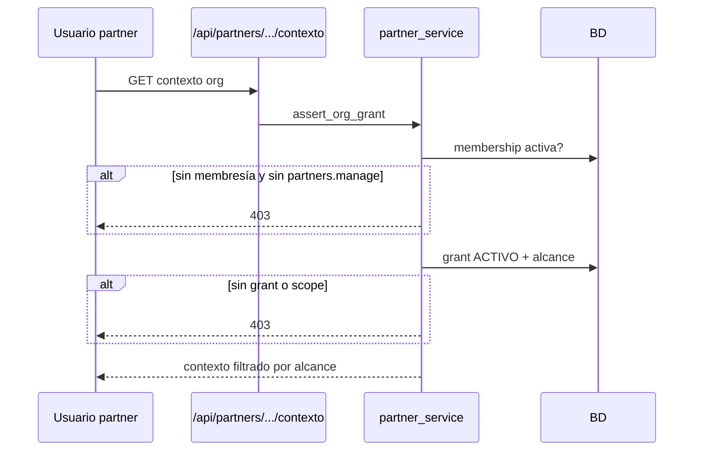

# Arquitectura — MB-03 Partners

## Capas

```
Frontend (React)
  PartnersPage / PartnerDetailPage
       ↓ REST
Backend API — routers/partners.py
       ↓
Servicio — services/partner_service.py
       ↓
Modelos — partner_models.py
       ↓
PostgreSQL / SQLite (tests)
```

## Componentes

| Componente | Ruta |
|------------|------|
| Modelos | `backend/app/partner_models.py` |
| Servicio | `backend/app/services/partner_service.py` |
| API | `backend/app/routers/partners.py` |
| Migración | `backend/alembic/versions/1410a1b2c3d4e_partners_mb03.py` |
| UI listado | `frontend/src/pages/PartnersPage.tsx` |
| UI detalle | `frontend/src/pages/PartnerDetailPage.tsx` |
| Permisos | `backend/app/permissions.py` → `PARTNER_PERMISSIONS` |
| Tests | `tests/test_mb03_partners.py` |

## Principios

1. **Backend autoridad** — toda concesión de acceso se valida en `partner_service`
2. **Deny by default** — sin grant activo → 403
3. **Membresía partner** — usuarios partner acceden solo vía `PartnerUserMembership`
4. **Plataforma separada** — administradores con `partners.manage` operan sin ser miembros
5. **No herencia automática** — un partner nunca ve todas las organizaciones

## Flujo de acceso a organización


