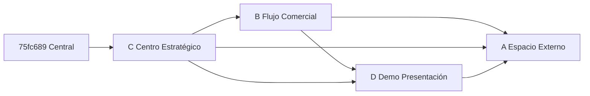

# 07 — Orden de portado recomendado

**Base de integración:** candidato central `75fc689`
**Orden propuesto:** **C → B → D → A** (no A→B→C→D)

---

## Justificación del orden

| Orden | Rama | Razón |
|-------|------|-------|
| **1** | **C** | Define **autoridad de gobierno/aprobaciones** y **Centro Estratégico**; B y D dependen de evaluación/hallazgos/oportunidades; C no depende de espacio externo ni demo |
| **2** | **B** | **Motor comercial** (prospecto→cliente, propuesta, contrato) consume evaluación C; debe existir antes de conectar demo y portal |
| **3** | **D** | **Demo + presentación** adapta a evaluación (C) y puede enlazar propuesta (B); no debe fijar autoridad de publicación |
| **4** | **A** | **Espacio externo + evidencias + publicación canónica** es el más transversal y conflictivo (`main`, `permissions`, migraciones 1410/1430); portar al final minimiza re-trabajo |

---

## Fases y puntos de prueba acumulativa

### Fase 0 — Preparación (GENERAL, sin código candidato)

- [ ] Congelar SHA de referencia A/B/C/D
- [ ] Renumerar plan de migraciones (`06_MIGRACIONES.md`)
- [ ] Resolver colisión `control_center` (B vs C) — **decisión antes de Fase 1**
- [ ] Resolver colisión `1410` (A vs C vs D)

**Prueba:** `alembic heads` = **1**; `pytest` suite central verde.

---

### Fase 1 — Portar C (Centro Estratégico)

**Incluir:**
- `strategic_control_models.py`, `strategic_control_service.py`, `strategic_control.py`
- `gobierno_models.py` (extensión), `gobierno_service.py`, `gobierno.py`
- `control_center_service.py` (versión C — gobierno + strategic)
- `control_center.py` router (versión C)
- Migraciones C renumeradas (sin 1410 colisionante — usar nueva revisión única)
- Frontend: `CentroControlEstrategicoPage`, `GobiernoPage`, `api.ts` parcial, `App.tsx` rutas
- Tests C

**Excluir / adaptar:**
- No portar `1410` literal de C si A/D ya usaron ese id — **nueva revisión**

**Prueba acumulativa 1:**
- API `/api/strategic-control/*` y `/api/gobierno/*`
- Evaluación → hallazgos → oportunidades (interna/externa)
- `pytest tests/test_strategic_control_v1.py tests/test_gobierno_v1.py` (renombrar si aplica)
- Frontend build + navegación Centro Estratégico

---

### Fase 2 — Portar B (Flujo comercial)

**Incluir:**
- `flujo_comercial_models.py`, `flujo_comercial_service.py`, `flujo_comercial.py`
- Extensión `control_center_service` solo si **no** pisa C — preferir **conectar** B a strategic/gobierno vía servicios
- Migraciones B (renumeradas; `MOD` de tablas existentes en una sola revisión)
- Frontend: `FlujoComercialPage`, menú
- Permisos `flujo_comercial.*` merge en `permissions.py`
- Tests B

**Prueba acumulativa 2:**
- Prospecto → propuesta → contrato → cliente
- Oportunidad C → propuesta B (correlation_id)
- Economía: **solo** `motor_economico` — B como consumidor
- `pytest` flujo comercial + regresión C

---

### Fase 3 — Portar D (Demo + presentación)

**Incluir:**
- `demo_comercial_models.py`, `demo_comercial_service.py`, `demo_comercial.py`
- `presentacion_publicacion_v1` como **adapter** (no autoridad final)
- Migraciones D renumeradas
- Frontend: `DemoComercialPage`, `PresentacionEjecutivaPage`
- Tests D

**Adaptar obligatorio:**
- `PresentacionPublicacion` → lee `EmpresaPublicacion` cuando A esté (Fase 4); en Fase 3 puede ser stub con flag
- No segundo scheduler de informes

**Prueba acumulativa 3:**
- Demo → área/problema → evaluación (C)
- Presentación ejecutiva (audiencias Gerencia/Operación/Sistemas/Financiero)
- Sin filtración economía privada a prospecto
- `pytest` demo + regresión B+C

---

### Fase 4 — Portar A (Espacio externo + evidencias + publicación)

**Incluir:**
- `espacio_externo_models.py`, servicios, router
- `evidencia_entrega_service.py`, `knowledge_storage` extensiones
- `EmpresaPublicacion` — **autoridad publicación**
- Migraciones A renumeradas (1430 evaluación, 1431 publicación, 1432 evidencias — nuevos ids)
- Frontend: `EspacioExternoPortalPage`, interno
- Permisos `espacio_externo.*`
- Tests A (28 tests)

**Prueba acumulativa 4 (lote completo):**
- Flujo E2E documentado en `04_FLUJO_COMERCIAL_UNIFICADO.md`
- Portal externo + upload evidencias + validación
- Publicación única: A; C selecciona qué publicar; D presenta
- MB-11 informes desde configuración comercial
- `pytest` full comercial + espacio externo
- Frontend build completo

---

## Dependencias entre fases (diagrama)

---

## Qué NO hacer entre fases

- Microcertificación por archivo
- Cherry-pick ciego entre ramas
- Portar migraciones con revision id histórico colisionante
- Segundo `control_center_service` activo
- Segundo motor económico

---

## Criterio de “lote único” listo para GENERAL

Un solo PR de convergencia cuando:

1. `alembic upgrade head` único
2. Un router `control_center`, un `permissions.py` mergeado
3. Matriz `02` sin ítem **DESCARTAR** pendiente de decisión
4. Flujo `04` ejecutable en staging con datos ficticios (D)
5. P0 de `08_HUECOS_REALES_V1.md` resueltos o aceptados
